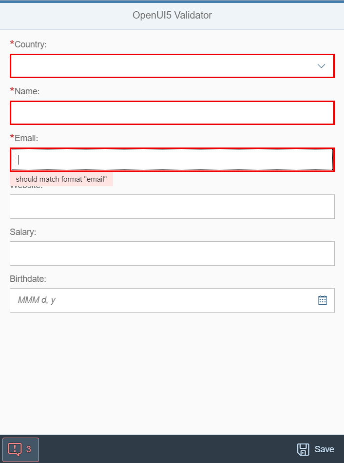

# openui5-validator


[](https://www.npmjs.com/package/openui5-validator)

[](https://www.linkedin.com/in/mauriciolauffer)

An OpenUI5 library to validate fields.

This library uses Ajv, a JSON schema validator. All validation keywords available in Ajv can be used.

## JSON Schema and Ajv

For any references, please follow

* [JSON schema specification](http://json-schema.org/)
* [Ajv documentation](https://github.com/epoberezkin/ajv)

Ajv Options: <https://github.com/epoberezkin/ajv#options>

Ajv Keywords: <https://github.com/epoberezkin/ajv#validation-keywords>

## Demo

You can check out a live demo here:

<https://mauriciolauffer.github.io/openui5-validator/demo/webapp/index.html>



## Project Structure

* demo - Library's live demo
* dist - Distribution folder which contains the library ready to use
* src  - Development folder
* test - Testing framework for the library

## Getting started

### Installation

Install openui5-validator as an npm module

```sh
$ npm install openui5-validator
```

### Configure manifest.json

Add the library to *sap.ui5/dependencies/libs* and set its path in *sap.ui5/resourceRoots* in your manifest.json file, as follows:

```json
{
  "sap.ui5": {
    "dependencies": {
      "libs": {
        "openui5.validator": {}
      }
    },
    "resourceRoots": {
      "openui5.validator": "./FOLDER_WHERE_YOU_PLACED_THE_LIBRARY/openui5/validator/"
    }
  }
}
```

### How to use

Import openui5-validator to your UI5 controller using *sap.ui.require*:

```javascript
sap.ui.require([
  'openui5/validator/Validator'
], function (Validator) {
  const validationSchema = {
    properties: {
      email: { //UI5 control ID
        type: 'string',
        format: 'email',
        minLength: 3 //required
      },
      salary: { //UI5 control ID
        type: 'number',
        minimum: 0,
        maximum: 9999999
      },
      birthdate: { //UI5 control ID
        format: 'date'
      }
    }
  };

  const validator = new Validator(this.getView(), validationSchema);
  if (validator.validate()) {
    console.log('Valid!');
  } else {
    console.log('Invalid! Errors...');
    console.dir(validator.getErrors());
  }
});
```

## Config Parameters

| Name | Type | Default| Description
| :---- | :------------------- | :---- | :---------  |
| view | sap.ui.core.mvc.View | null | UI5 view which contains the fields to be validated.
| schema | object | null | JSON schema used for validation
| opt | object | null | Parameters to initialize Ajv

## Author

Mauricio Lauffer

* LinkedIn: [https://www.linkedin.com/in/mauriciolauffer](https://www.linkedin.com/in/mauriciolauffer)

## License

This project is licensed under the MIT License - see the [LICENSE](LICENSE) file for details
